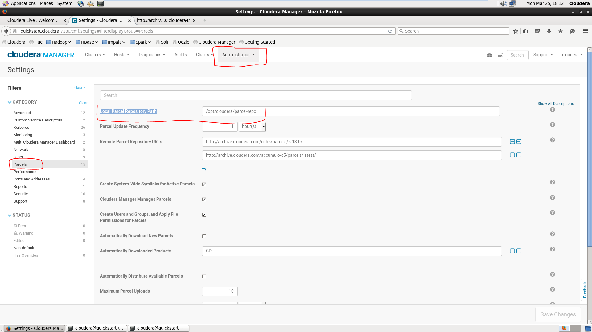

## Download CDH parcel for Spark2
	Check for available version on 	https://www.cloudera.com/documentation/spark2/latest/topics/spark2_packaging.html#versions
	and download for provided link.

## Step by Step Instruction follow below link for Spark2
    https://www.cloudera.com/documentation/spark2/latest/topics/spark2_installing.html

## Where to place CDH parcels after downloaded
    Go to Administration Tab then click on Parcels on left navigaton bar and check value of "Local Parcel Repository Path" property.
    
## Important Points
    Download Spark parcel compatible to your Linux OS like RHEL6 or RHEL7

## Another way of adding CDH parcels to Cloudera Manager
    1. Go to Cloudera Manager GUI.
    2. Click on Hosts dropdown and select parcels.
    3. Then click on Configuration Tab on right hand side top corner and add "Remote Parcel Repository URLs" for new parcels.
    4. Finally restart Cloudera Manager to take effect.
    5. After successfully restart of CM again repeat step 1 and 2.
    6. Now you are able to see CDH parcel 
    

    
    7. Refer above pics and click on download. Once parcel download then distribute option apear against that parcel.
    8. Then click on distribute then activate.
    

